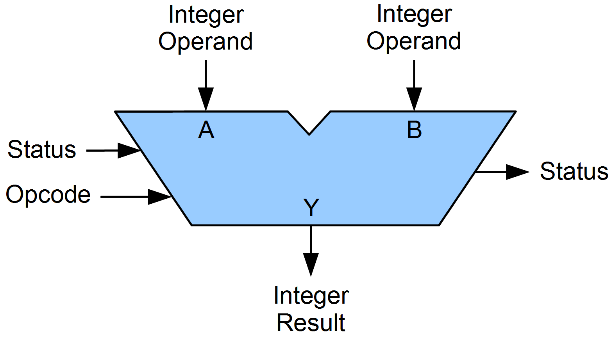

# ALU와 제어장치

## Arithmetic Logic Unit

- 레지스터를 통해 피연산자를 받아들임
- 제어장치로부터 제어신호 -> 연산자를 받아들임

 > 연산 속도 >>>>> 메모리 접근 속도 => ALU의 결과값을 레지스터에 우선 저장
 
 status(flag), 연산에 대한 추가적인 정보(오버플로우 등)도 결과와 함께 출력
 
 flag register : cpu가 프로그램을 실행하는 도중 참고하는 상태를 저장하는 레지스터
- 부호
- zero
- carry
- overflow
- interrupt
- supervisor : kernel mode <-> user mode context switching

### 제어 장치
제어 신호를 내보내고 명령어를 해석
- 클럭 신호의 수신
- 명령어 수신
- 플래그 수신
- 제어 버스에서 제어 신호 수신(메모리, io)
 
# 레지스터
- program counter : 메모리에서 읽어들일 명령어의 주소를 저장
- instruction register : 메모리에서 읽어들인 명령어를 저장
- memory address register : 메모리의 주소 저장
- memory buffer register : 메모리와 주고받을 값을 저장