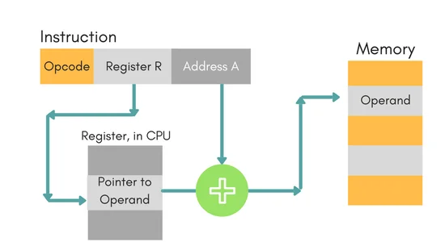
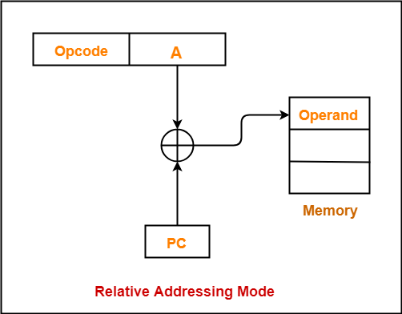
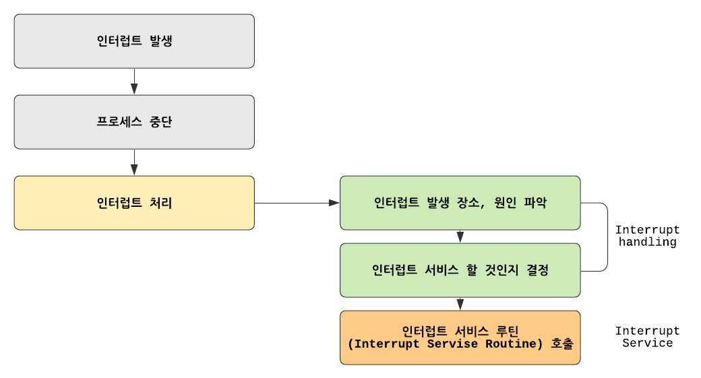

# ALU와 제어장치

## Arithmetic Logic Unit

- 레지스터를 통해 피연산자를 받아들임
- 제어장치로부터 제어신호 -> 연산자를 받아들임

 > 연산 속도 >>>>> 메모리 접근 속도 => ALU의 결과값을 레지스터에 우선 저장
 
 status(flag), 연산에 대한 추가적인 정보(오버플로우 등)도 결과와 함께 출력
 
 flag register : cpu가 프로그램을 실행하는 도중 참고하는 상태를 저장하는 레지스터
- 부호
- zero
- carry
- overflow
- interrupt
- supervisor : kernel mode <-> user mode context switching

### 제어 장치
제어 신호를 내보내고 명령어를 해석
- 클럭 신호의 수신
- 명령어 수신
- 플래그 수신
- 제어 버스에서 제어 신호 수신(메모리, io)
 
# 레지스터
- program counter : 메모리에서 읽어들일 명령어의 주소를 저장
- instruction register : 메모리에서 읽어들인 명령어를 저장
- memory address register : 메모리의 주소 저장
- memory buffer register : 메모리와 주고받을 값을 저장

- general register : 일반적인 상황에서 자유롭게 사용할 수 있는 레지스터
- 플래그 레지스터 : 연산 결과나 부가적인 정보를 저장하는 레지스터

## 주소 지정 방식
### 특정한 레지스터를 이용한 주소 지정 방식
-  스택 주소 지정 방식 : 스택과 스택 포인터를 활용
   -  스택 포인터 : 스택에 마지막으로 저장한 값의 위치를 저장하는 레지스터
   -  스택 영역 : 메모리 내부에 스택으로 이용하도록 지정된 영역
- 변위 주소 지정 방식 : 오퍼랜드 필드의 값과 특정 레지스터의 값을 더하여 유효 주소를 얻음
- 
  - 상대 주소 지정 방식 : 분기하여 특정 주소의 코드를 실행할때
  
  
  
  operand + PC => 유효 주소

- 베이스 레지스터 주소 지정 방식 : 기준 주소로부터 얼마나 떨어져 있는 주소에 접근할 것인지

# 명령어 사이클과 인터럽트
- instruction cycle : 하나의 명령어를 처리하는 정형화된 흐름으로 일정한 주기로 반복됨
- interrupt : 흐름이 끊어지는 상황

- instruction cycle의 과정
  
  1. fetch : 인출, 메모리에 저장된 명령어를 cpu로 가져온다.
  2. execution : 가져온 명령어를 실행, 제어장치가 명령어 레지스터에 담긴 값을 해석, 제어 신호를 발생
  3. indirect cycle : 간접 주소 지정 방식인 경우 값을 가져오기 위해 메모리에 한번 더 접근함
   
- Interrupt
  - 동기 : cpu가 명령어를 실행하다 예상치 못한 상황에 빠질 때, exception
  - 비동기 : 입출력장치에 의해, 하드웨어 인터럽트
  
  