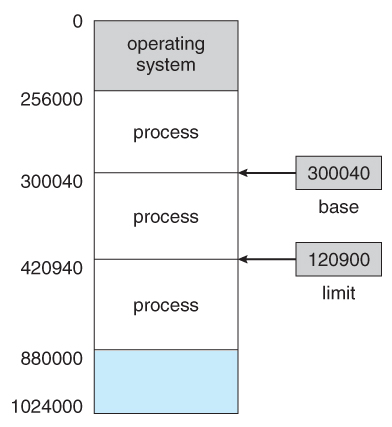
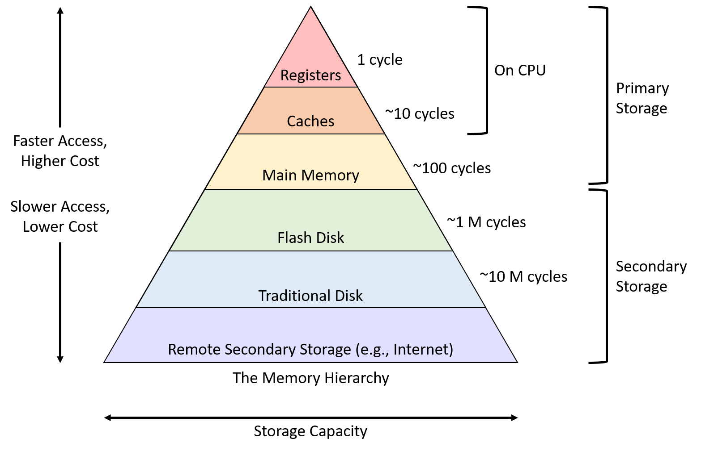

# CH06. 메모리와 캐시 메모리

## RAM
휘발성(volatile memory) <-> 비휘발성(non-volatile memory)

### RAM의 종류
- DRAM : Dynamic RAM, 저장된 데이터가 동적으로 변함(사라짐)
  - 소멸을 막기 위해 일정 주기로 데이터를 재활성화(다시 저장) 해야함
  - 소비 전력이 비교적 낮음
  - 저렴함
  - 고집적 -> 대용량

- SRAM : Static RAM, 저장된 데이터가 변하지 않음
  - 재활성화 필요없음
  - 소비 전력이 비교적 높음
  - 속도가 빠름
  - 집적도 낮음
  - 비쌈

- SDRAM : Synchronous Dynamic RAM
  - 클럭 신호와 동기화된 DRAM의 일종
  - 클럭 타이밍에 맞추어 CPU와 정보를 주고받음

- DDR SDRAM : Double Data Rate SDRAM
  - 속도를 빠르게 만든 SDRAM
  - 한 클럭 당 두 번씩 전송 가능
  - SDRAM에 비해 두배의 대역폭

- DDR4의 대역폭 = 2*DDR3 = 4\*DDR2 = 8\*DDR = 16\*SDRAM

### 메모리의 주소 공간
- 물리 주소 : 메모리 하드웨어가 사용하는 주소
  - 정보가 실제로 저장된 하드웨어상의 주소

- 논리 주소 : CPU와 프로세스가 사용하는 주소
  - 실행 중인 프로그램 각각에 부여된 0번지부터 시작되는 주소

> CPU <-> RAM : 논리 <-> 물리 주소의 변환이 이루어짐

### MMU(Memory Management Unit)
CPU가 발생시킨 논리 주소 + 베이스 레지스터 값 = 물리 주소 

### 메모리 보호 기법
- limit register : 논리 주소의 최대 크기를 저장
- 접근하려는 논리 주소는 한계 레지스터가 저장한 값보다 클 수 없음
- 한계 레지스터의 값 == 프로그램에 할당된 주소의 범위 == **프로그램의 최대 크기**
- 주소값 범위 검사 -> 한계 레지스터의 값보다 큰 값에 접근 => 인터럽트 발생

> 베이스 레지스터 값 <= 프로그램의 물리 주소 범위 < 베이스 레지스터 값 + 한계 레지스터 값

## 캐시 메모리

### 저장 장치 계층 구조

- 저장 장치의 기본 특성
1. CPU와 가까우면 빠르고 멀면 느리다.
2. 빠르면 용량이 작고 비싸다. 

### Cache Memory
  - CPU와 메모리 사이에 위치
  - 레지스터보다 용량이 크고 메모리보다 빠름
  - SRAM 기반
  - CPU의 연산 속도와 메모리 접근 속도 차이로 인한 병목을 줄이기 위한 목적
  - 코어에 가까운 순서대로 L1, L2, L3...
  
  > 분리형 캐시(split cache) : 코어와 가장 가까운 L1 캐시의 접근 속도를 높이기 위해 L1I(명령어만 저장), L1D(데이터만 저장)로 분리

- 캐시는 CPU가 사용할 것들을 예측해서 저장
- 캐시 히트 : 예측한 데이터가 맞아서 CPU에서 활용됨
- 캐시 미스 : 예측이 틀려 메모리에서 인출
- Cache hit ratio : 현대 컴퓨터에서 85% 이상

- 참조 지역성 원리 : locality of principle, 메모리에서 데이터를 가져오는 원리
1. CPU는 최근에 접근했던 메모리 공간에 다시 접근하려는 경향이 있다.
    - temporal locality : 시간 지역성
    - 변수가 저장된 공간은 언제든 다시 참조될 수 있음
    - 변수에 저장된 값은 일반적으로 여러번 사용됨
2. CPU는 접근한 메모리 공간 근처를 접근하려는 경향이 있다.
    - spatial locality : 공간 지역성
    - 연관 있는 데이터들은 모여서 저장됨

