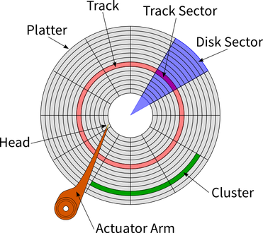
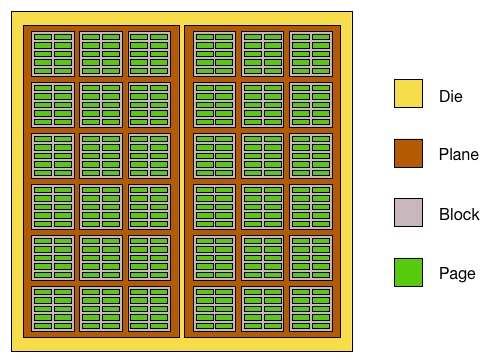
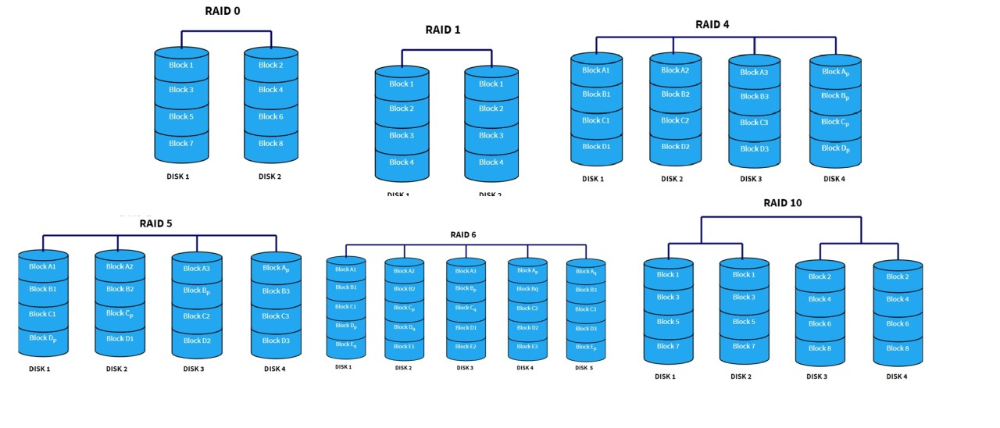

# 보조기억장치

## 하드디스크

- 플래터 : 자기 물질로 덮여져 데이터가 실제로 저장되는 곳
- 트랙 : 플래터를 동심원으로 나누었을 때, 그중 하나
- 섹터 : 트랙을 구성하는 하나의 조각
- 실린더 : 같은 트랙끼리 연결한 원통 모양의 공간
  - 연속된 정보 -> 하나의 실린더, 디스크 암을 움직이지 않고 바로 데이터에 접근 가능

- 탐색 시간 : seek time, 데이터가 저장된 트랙까지 헤드를 이동시키는 시간
- 회전 지연 : 헤드가 있는 곳으로 플래터를 회전시키는 시간
- 전송 시간 : 데이터를 전송하는 시간
- 단일 헤드(이동 헤드), 다중 헤드(고정 헤드)
> 보조기억장치에서도 참조 지역성 원칙은 중요하다

## 플래시 메모리

- 셀 : 데이터를 저장하는 가장 작은 단위
- page : 셀들이 모여 만들어짐, 읽기/쓰기가 이루어지는 단위
  - 3가지 상태
  1. Free : 데이터가 없어 새로운 데이터를 저장할 수 있는 상태
  2. Valid : 이미 유효한 데이터를 저장한 상태 -> 새 데이터 저장 불가
  3. Invalid : 쓰레기값을 가진 상태 

- block : 삭제가 일어나는 단위
- plane
- die

- 셀당 비트에 따라 SLC, MLC, TLC..
- 유한한 수명

> 삭제 단위가 블록으로 이루어지기 때문에 Garbage Collection 수행

### RAID(Redundant Array of Independent Disks)

RAID Level : 0~6 / 10, 50~

- RAID0 : Striping = 줄무늬처럼 여러 개의 저장장치에 번갈아 가며 저장
- RAID1 : Mirroring = 여러 개의 저장장치에 동일한 내용을 저장
- RAID4 : 완전한 복사본 대신 오류를 검출하고 복구하기 위한 정보(parity bit) 저장
- RAID5 : RAID4에서 패리티 정보 분산 저장
- RAID6 : RAID5에서 다른 두 개의 패리티를 두는 방식, 속도는 조금 느려짐