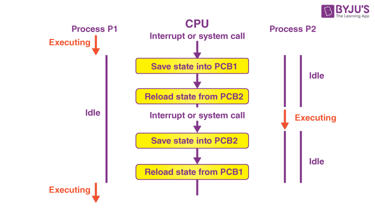

# Process
저장된 프로그램을 메모리에 적재하고 실행한 상태 => 프로세스
- daemon : 유닉스 계열에서 백그라운드 프로세스의 명칭
- service : 윈도우에서 백그라운드 프로세스의 명칭

## 프로세스 제어 블록
한정된 CPU자원을 모든 프로세스가 차례차례 돌아가며 나누어 사용하기 위한 방법

어떻게 CPU자원을 배분할 것인가?

### PCB(Process Control Block)
- 프로세스와 관련된 정보를 저장하는 자료구조
- 프로세스를 식별하기 위한 정보들이 저장
- 운영체제에 의해 커널 영역에 생성됨
- 프로세스 생성과 함께 생성, 종료 시 폐기

- PID(Process ID)
  - 프로세스를 식별하기 위해 부여하는 고유한 번호
  - 같은 프로그램을 두번 실행 -> PID가 다른 두 개의 프로세스

- Register Value  
  프로세스가 자신의 실행 순서가 되었을때 진행하던 작업을 이어서 하기 위해 이전까지 사용했던 레지스터의 값들을 모두 복원해야 함 -> 해당 프로세스가 사용했던 프로그램 카운터, 레지스터 값들을 PCB에 모두 저장함
- 프로세스 상태 : 현재 프로세스의 상태 -> 입출력 인터럽트, 현재 CPU 이용 여부 등
- CPU 스케줄링 정보 : CPU를 할당받는 시기, 순서  
- 메모리 관리 정보 : 프로세스가 저장된 주소, 베이스/한계 레지스터 값, 페이지 테이블 정보
- 사용한 파일과 입출력장치 목록 : 프로세스에 할당된 입출력 장치 목록, 파일 접근 정보

## Context Switching
프로세스간의 실행 순서가 넘어가는 경우 이전까지의 정보를 백업하고 넘어가야 함
- Context : 하나의 프로세스가 현재 실행되기 위해 필요한 정보들 => PCB
- Context Switching : 기본 프로세스의 문백을 PCB에 백업하고 다른 프로세스의 문맥을 PCB로부터 복구하는 것
- 스위칭에 따른 오버헤드가 존재하지만 여러 프로세스가 끊임없이 번갈아 빠르게 실행됨 -> 동시 실행으로 인지하게됨

### 프로세스의 메모리 영역
---
사용자 영역 프로세스의 내부 구조
- Code Segment : 텍스트 영역, 실행될 수 있는 기계어 명령어가 저장, 읽기 전용
- Data Segment : 프로그램이 실행되는 동안 유지할 데이터, 전역 변수 등
  - Code/Data Seg -> 크기가 고정됨, 정적 할당 영역
- Heap Segment : 프로그래머가 직접 할당할 수 있는 공간, 사용 이후 반환, 메모리를 반환하지 않는다면 메모리 누수 발생
- Stack Segment : 데이터를 일시적으로 저장하는 공간, 매개 변수, 지역 변수 등, push/pop의 과정으로 삽입 삭제
  - Heap과 Stack은 겹치지 않도록 주소의 차순이 다른 방향으로 메모리가 할당됨

## 프로세스 상태와 계층 구조
### 프로세스 상태
- 생성 상태 : 생성 중인 상태, 갓 메모리에 적재되어 PCB를 할당 받은 상태로 CPU의 할당을 기다림
- 준비 상태 : 실행될 수 있지만 차례가 되지 않아 CPU의 할당을 기다리고 있는 상태
- 실행 상태 : CPU를 할당받아 실행 중인 상태, 할당된 일정 시간동안 실행 후 다시 준비 상태로 돌아감
- 대기 상태 : 입출력 등의 인터럽트가 끝날 때까지 기다리는 상태
- 종료 상태 : 프로세스가 종료되고 운영체제가 PCB와 프로세스가 사용한 메모리를 정리

### 프로세스 계층 구조
프로세스는 실행 도중 시스템 콜을 통해 다른 프로세스를 생성 가능함
- 부모 <-> 자식

- 프로세스 트리에서 루트 노드
  - unix : init
  - linux : systemd
  - mac : launchd
- 최초 프로세스의 PID는 항상 1

### 프로세스 생성 기법
두 시스템 콜을 활용
- fork : 부모 프로세스가 자신의 복사본을 자식 프로세스로 생성함
- exec : 만들어진 복사본을 다른 프로그램으로 전환
- 자식은 부모의 복사본이기 때문에 메모리 내용, 파일 목록 등을 상속받음

## 스레드
프로세스를 구성하는 실행의 흐름 단위 -> 하나의 프로세스에서 여러 부분을 동시에 실행
- 프로세스의 자원을 공유함
- 개별적인 실행을 위해 필요한 자원들을 최소한으로 유지
- 현대 운영체제에서는 CPU에 스레드 단위로 작업을 할당함

- 멀티프로세스 : 여러 프로세스를 동시에 실행
- 멀티스레드 : 여러 스레드로 하나의 프로세스를 동시에 실행 -> 자원이 공유되므로 효율성 증가

- IPC : Inter-Process Communication, 프로세스간 통신

