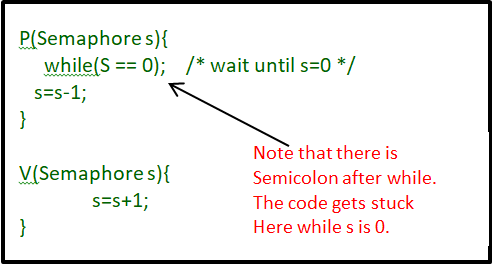

# 프로세스 동기화
## 동기화
- 프로세스들의 실행 순서와 자원의 일관성을 보장하기 위한 방법
- 동시다발적으로 실행되는 프로세스 -> 데이터를 주고받으며 협력
- 협력적으로 실행되는 프로세스 -> 동기화가 필수적

### 프로세스 동기화
프로세스들 사이의 수행 시기를 맞추는 것으로 다음 두 가지
- 실행 순서 제어 : 프로세스를 올바른 순서대로 실행
  - 읽기 / 쓰기의 경우 쓰기가 끝난 이후 읽기를 실행해야 함
- 상호 배제 : 동시에 접근해서는 안 되는 자원에 하나의 프로세스만 접근하게 하기
  - 동시에 자원에 접근하는 경우 잘못된 처리 결과가 발생할 수 있음
  - 한 프로세스가 자원에 접근했을 때 다른 프로세스는 기다려야 함


### 생산자와 소비자 문제
```
생산자 : 물건을 계속해서 생산하는 프로세스
소비자 : 물건을 계속해서 소비하는 프로세스
- 생산자와 소비자는 총합을 공유
- 생산자 -> 버퍼에 데이터 삽입 / 총합 += 1
- 소비자 -> 버퍼에 데이터 제거 / 총합 -= 1
```
> 생산자와 소비자가 동시에 총합을 수정 => 잘못된 결과 발생

- 공유 자원(shared resource) : 생산자와 소비자 공동의 자원
- 임계 구역(critical section) : 동시에 실행하면 문제가 발생하는 공유 자원에 접근하는 코드 영역
  - 두개 이상의 프로세스가 임계 구역에 접근하는 경우
  - 먼저 진입한 프로세스의 작업이 마무리될 때까지 대기
- race condition : 잘못된 실행으로 여러 프로세스가 동시 다발적으로 임계 구역의 코드를 실행
  - 데이터의 일관성이 깨지는 결과 초래
  - 계좌 잔액 문제
  - 생산자 소비자 문제
  - 근본 원인 : 고급 언어가 여러 줄의 저급 언어로 변환 -> 실행 도중 context switching 발생

- 운영체제의 세 가지 원칙 : 임계 구역 문제의 해결
  - 상호 배제(mutual exclusion) : 한 프로세스가 임계 구역에 진입했다면 다른 프로세스는 진입 불가
  - 진행(progress) : 임계 구역에 어떤 프로세스도 진입하지 않았다면 진입하고자 하는 프로세스는 들어갈 수 있어야 함
  - 유한 대기(bounded waiting) : 한 프로세스가 임계 구역에 들어오기 위해 무한정 대기해서는 안됨


## 동기화 기법

### Mutex Lock(Mutual Exclusion Lock)
상호 배제를 위한 동기화 도구, 하나의 공유 자원에 접근하는 경우

- 프로세스가 있으면 임계 구역을 잠금
- 구조
  - lock : 프로세스들이 공유하는 전역 변수, 자물쇠 역할
  - acquire : 임계 구역을 잠그는 함수
    - 프로세스가 임계 구역에 진입하기 전 호출
    - 임계 구역이 잠겨 있다면, lock=false가 될 떄까지 반복해서 확인
    - 열려 있다면 lock=true로 변경
  - release : 임계 구역의 잠금을 해제하는 함수
    - 임계 구역에서의 작업이 끝나고 호출
    - lock=false로 변경

```
acquire();
// 임계 구역
release();
```
> acquire가 lock을 계속해서 반복적으로 확인 => busy wait 방식

### Semaphore 

여러 개의 공유 자원에 접근하는 경우의 동기화 도구, 세마포=철도 신호기

- 상호 배제를 위한 동기화
  - S : 임계 구역에 진입할 수 있는 프로세스의 개수=사용 가능한 공유 자원의 개수를 나타내는 전역변수
  - wait : 임계 구역에 진입할지 기다려야 할지 알려주는 함수
  - signal : 임계 구역에 진입해도 된다고 신호를 주는 함수

  
  ```
  wait();
  // 임계 구역
  signal();
  ```
  - 사용할 수 있는 공유 자원이 없는 경우 => busy wait으로 CPU주기를 낭비
  - 실제 세마포의 작동
    1. 사용할 수 있는 자원이 없는 경우 : wait 함수가 프로세스를 대기 상태 전환
    2. 프로세스의 PCB를 세마포의 대기 큐에 삽입
    3. 임계 구역의 작업이 끝나고 signal 호출
    4. signal 함수가 대기 큐에서 프로세스를 제거하고 준비 상태로 변경 후 준비 큐에 삽입

- 실행 순서 제어를 위한 동기화
  - S = 0으로 초기화
  - 먼저 실행할 프로세스 뒤에 signal
  - 다음 실행 프로세스 앞에 wait

### 모니터
세마포 -> 매번 임계 구역 앞뒤로 wait과 signal을 명시해야함
> 코드가 방대해지는 경우 오류 발생 가능성 증가

- 세마포의 단점을 보완하기 위해 최근 등장한 도구
- 공유 자원과 공유 자원에 접근하기 위한 인터페이스를 묶어서 관리
- 프로세스는 인터페이스를 통해서만 공유 자원에 접근 가능
- condition variable : 특정 조건을 바탕으로 프로세스를 실행/일시 중단