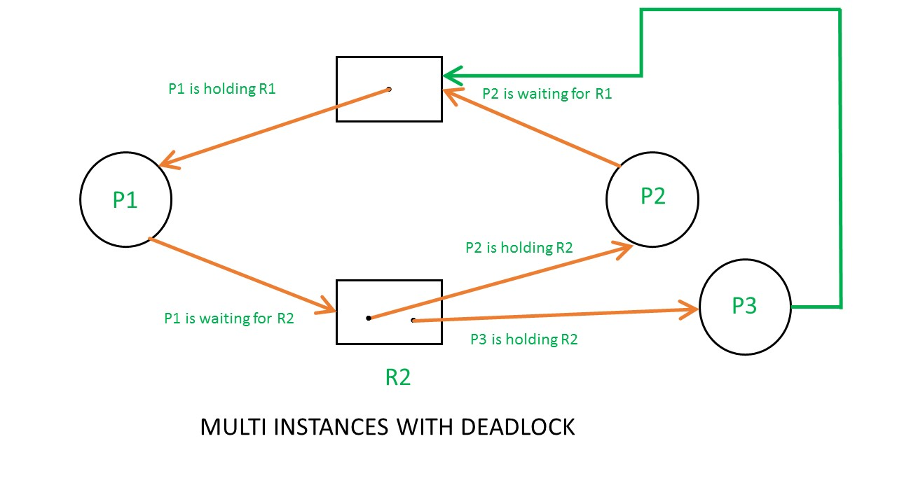

# 교착 상태

## 식사하는 철학자 문제

모든 철학자가 동시에 포크를 집어듦 -> 모든 철학자가 다른 철학자가 포크를 내려놓을 때까지 기다림

=> 교착 상태(deadlock)

철학자 = 스레드

포크 = 자원

생각 = 자원을 기다림

> 프로세스들이 상대방이 가진 자원을 기다리기만 하다 실행을 못 하는 상황

### 자원 할당 그래프
교착 상태를 단순하게 표현한 그래프

- 프로세스 : 원

- 자원 : 사각형

- 자원의 개수 : 사각형 내의 점

- 자원을 사용 중인 프로세스 : 자원에서 프로세스로 화살표

- 자원을 대기 중인 프로세스 : 프로세스에서 자원으로 화살표

> deadlock이 발생한 그래프 -> 사이클이 존재

### 교착 상태 발생 조건
- 상호 배제(mutual exclusion) : 한 프로세스가 사용하는 자원을 다른 프로세스가 사용할 수 없는 상황

- 점유와 대기(hold and wait) : 자원을 할당받은 상태에서 다른 자원을 기다리는 상태
- 비선점(nonpreemptive) : 다른 프로세스의 자원을 강제로 빼앗지 못함
- 원형 대기(circular wait) : 자원 할당 그래프에서 사이클이 존재하는 경우 발생 __가능__

  *사이클이 존재하는 경우*

  - 각 자원 유형마다 하나의 자원 : 교착상태 무조건 발생

  - 각 자원 유형마다 여러개의 자원 : 발생할 가능성이 있음

## 교착 상태 해결 방법

### 예방
- 상호 배제 제거 : 모든 자원을 공유 가능하게 만듦 -> 어려움

- 점유와 대기 제거 : 특정 프로세스에 자원을 모두 할당하거나 아예 할당하지 않거나

  - 자원의 활용률이 낮아짐

  - 많은 자원을 사용하는 프로세스의 대기 시간이 길어짐 -> 기아 현상

- 비선점 조건 제거 : 자원을 빼앗게

  - 일부 자원에 대해서 효과적 (cpu..)

  - 선점 불가능한 자원이 존재해서 범용성이 떨어짐

- 원형 대기 조건 제거 : 모든 자원에 번호를 붙이고 오름차순으로 할당

  - 모든 자원에 번호를 붙이기 -> 리소스 사용 증가
  
  - 자원에 할당된 번호에 따라 특정 자원의 활용률 감소 

  - 그나마 현실적

### 교착 상태 회피
https://www.geeksforgeeks.org/deadlock-prevention/

교착 상태가 발생하지 않을 정도로만 자원을 할당

- 안전 상태(safe state) : 모든 프로세스가 정상적으로 자원을 할당받고 종료될 수 있는 상태

- 불안전 상태 : 교착 상태가 발생할 수 있는 상황

- 안전 순서열(safe sequence) : 교착 상태 없이 안전하게 프로세스들에 자원을 할당할 수 있는 순서

> 안전 순서열이 있는 상태 -> 안전 상태

안전 순서열 구하기 : banker's algorithm

    https://howudong.tistory.com/366

### 교착 상태 검출 후 회복
교착 상태 발생 이후 조치하는 방식

- 선점을 통한 회복 : 교착 상태가 해결될 때까지 다른 프로세스에서 자원을 빼앗아 하나에 몰아주기
- 강제 종료를 통한 회복 : 모든 프로세스 혹은 교착 상태가 없어질 떄까지 강제 종료
- 타조 알고리즘(ostrich algorithm) : 드물게 발생하는 잠재적 문제를 무시
